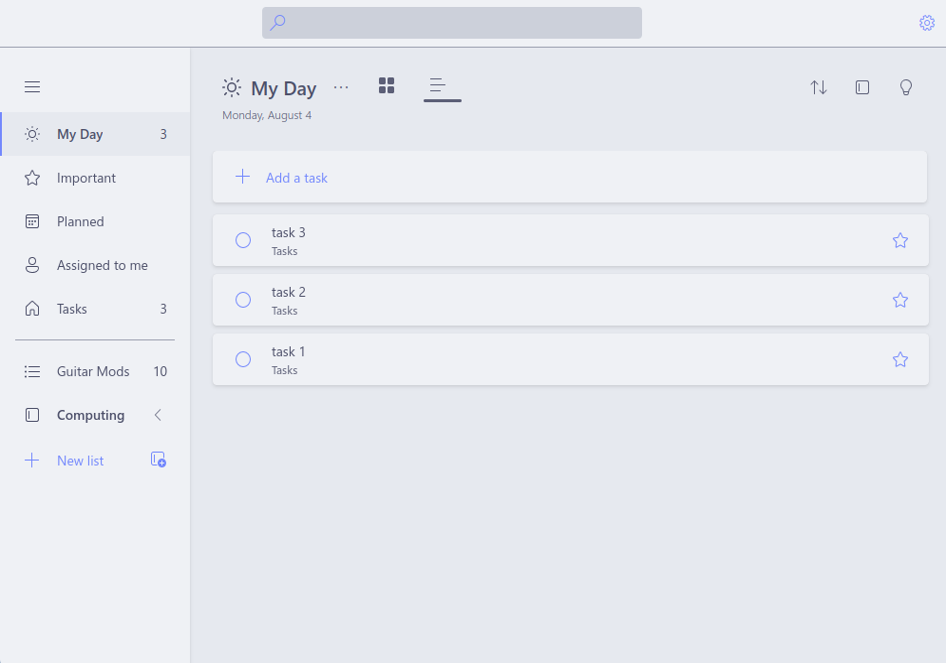
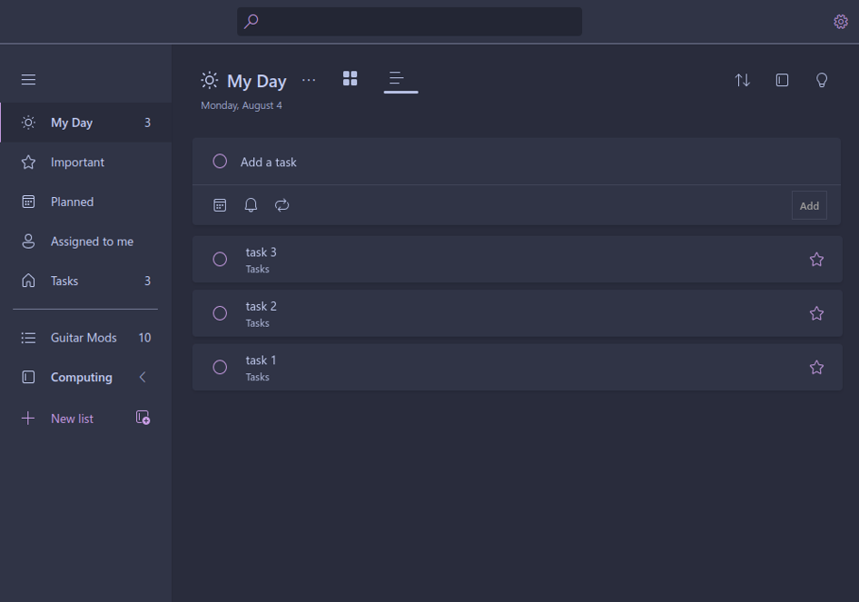
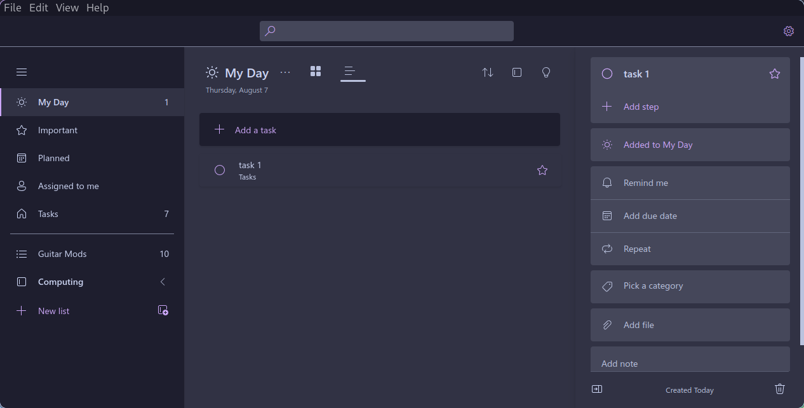

<h3 align="center">
	<br/>
	
	Catppuccin for <a href="https://github.com/dakiak/kuro">Kuro</a>
	
</h3>

<p align="center">
	<a href="https://github.com/stephanlamoureux/kuro-catppuccin/stargazers"></a>
	<a href="https://github.com/stephanlamoureux/kuro-catppuccin/issues"></a>
	<a href="https://github.com/stephanlamoureux/kuro-catppuccin/contributors"></a>
</p>

<p align="center">
	
</p>

## 📷 Previews

<details>
<summary>🌤️ Latte</summary>

</details>
<details>
<summary>🧊 Frappé</summary>

</details>
<details>
<summary>🍵 Macchiato</summary>

</details>
<details>
<summary>🌑 Mocha</summary>

</details>

## 🚀 Usage

1. Clone this repository:
```bash
git clone https://github.com/stephanlamoureux/kuro-catppuccin.git
```

2. Copy your desired flavor from the `themes/` folder.
3. Import it into your Kuro configuration located in `.kuro.json`.

## 💝 Thanks to

- [Catppuccin](https://github.com/catppuccin) for the gorgeous color palette.
- [kuro](https://github.com/davidsmorais/kuro) for the Microsoft ToDo Linux app port.
- [Stephan Lamoureux](https://github.com/stephanlamoureux) for maintaining this port.

&nbsp;

<p align="center">
	
</p>

<p align="center">
	Copyright &copy; 2021-present <a href="https://github.com/catppuccin" target="_blank">Catppuccin Org</a>
</p>

<p align="center">
	<a href="https://github.com/catppuccin/catppuccin/blob/main/LICENSE"></a>
</p>
