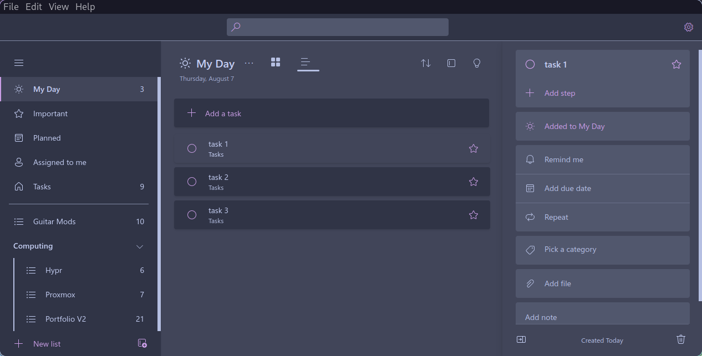

# 🐾 Catppuccin for Kuro

<p align="center">
  
</p>

## 🎨 Flavorful themes for [Kuro](https://github.com/davidsmorais/kuro)

This port brings the soothing Catppuccin color palette to Kuro, with full support for all four official flavors:

- 🌑 Mocha
- 🧊 Frappe
- 🍵 Macchiato
- 🌤️ Latte

Each file in `themes/` is carefully tuned to match Catppuccin’s aesthetic and works beautifully with Kuro's modern interface.

---

## 📷 Previews

| Latte | Frappe |
|:-:|:-:|
|  |  |

| Macchiato | Mocha |
|:-:|:-:|
|  |  |

---

## 🚀 Usage

1. Clone this repository:
```bash
git clone https://github.com/your-username/catppuccin-kuro.git
```

2. Copy your desired flavor from the `themes/` folder.
3. Import it into your Kuro configuration located in `.kuro.json`.

---

## 💝 Thanks to

- [Catppuccin](https://github.com/catppuccin) for the gorgeous color palette.
- [Kuro](https://github.com/kuroni/kuro) for the Microsfot Todo port.

---

## 💬 Feedback

Feel free to open an issue or pull request for suggestions, tweaks, or fixes. Contributions welcome!

## 📝 License

[MIT](./LICENSE)
